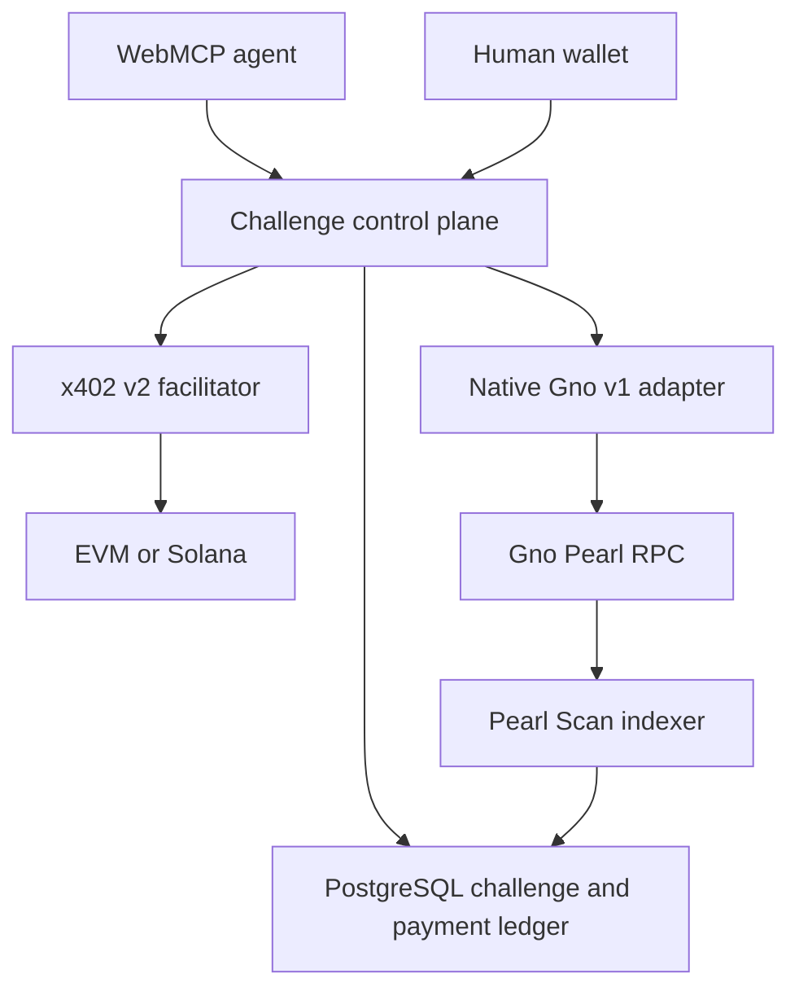

# Architecture

## System shape

x402 Agent Gateways has one chain-neutral control plane and three chain families. The v2 path uses official x402 protocol types and `HTTPFacilitatorClient`, official EVM definitions, and the official SVM Exact client for Solana payload construction. The EVM browser path assembles the EIP-3009 authorization with viem/EIP-1193 against those definitions; it does not claim to call an all-in-one SDK checkout helper. Gno Pearl keeps its native v1 verifier, broadcaster, and Scan indexer. The browser owns wallet interaction; server code never receives a private key.

Production is a standard Next.js application on Vercel with a dedicated Neon PostgreSQL database. A bearer-protected Vercel cron runs one bounded Scan snapshot daily at 03:00 UTC; it is not a continuous explorer. The Docker topology also supports a future persistent Railway worker, but Railway provisioning is currently blocked by the free-plan resource limit.

## Rail registry

`lib/multichain.ts` is the authoritative registry for five rails:

| Rail ID                | Family | API               | Wallet            | Default posture                                                       |
| ---------------------- | ------ | ----------------- | ----------------- | --------------------------------------------------------------------- |
| `evm-base-sepolia`     | EVM    | v2                | EIP-6963/EIP-1193 | `sdk_ready`                                                           |
| `evm-ethereum-mainnet` | EVM    | v2                | EIP-6963/EIP-1193 | `locked`                                                              |
| `svm-solana-devnet`    | SVM    | v2                | Wallet Standard   | `sdk_ready`                                                           |
| `svm-solana-mainnet`   | SVM    | v2                | Wallet Standard   | `locked`                                                              |
| `gno-pearl`            | Gno    | v1 native adapter | Adena             | `native_ready` when its recipient/self-test prerequisites are present |

The status names describe application configuration and adapter readiness, not chain finality. Automated verification passed 118/118 tests on 2026-09-03, but recorded real-wallet payments remain 0 across Base Sepolia, Solana Devnet, and Gno Pearl.

## Wallet-bound v2 lifecycle

1. `POST /api/v2/challenges` receives the selected rail and expected wallet address.
2. The server verifies that the facilitator advertises the exact x402 v2 network.
3. The server generates one random `challengeId` and one `pay_…` payment ID. For EVM it also derives the authorization nonce from the issued identifiers and exact terms. Clients must echo these values and cannot choose replacements.
4. It constructs one exact requirement for the configured asset, amount, recipient, and expiry. EVM terms bind `from`, `to`, value, authorization nonce, and validity window. Solana terms include the facilitator fee payer and resource memo.
5. PostgreSQL stores the authoritative requirements hash, resource object, expected payer, expected payment ID, and initial Solana unsigned-message hash before a signature is requested.
6. The response returns the structured `paymentRequired` object and a base64 `Payment-Required` header.
7. Immediately before signing, `/api/v2/review` reloads the challenge and compares the resource, payer, requirements, and prior Solana unsigned message. For Solana it then uses the official SVM Exact client to obtain a current blockhash, atomically swaps the stored message hash, and returns the refreshed unsigned payload. The challenge ID, payment ID, and requirements do not change; only that returned payload may be signed.
8. `/api/v2/verify` and `/api/v2/settle` repeat the binding checks, including the refreshed Solana message hash, then delegate facilitator verification/settlement through the official HTTP client.
9. Settlement claims the server-issued payment ID and challenge atomically. A second request can only replay the same signed-payload fingerprint; a changed fingerprint fails.
10. A reported success is accepted only when its network, payer, optional amount, and chain-specific transaction identifier match the issued terms. Ambiguous or mismatched results remain pending/broadcast and cannot unlock the resource.
11. When a pending row has a valid transaction hash, an identical retry performs read-only chain reconciliation and never calls facilitator settlement again. EVM requires a finalized successful receipt, decoded `transferWithAuthorization` fields, and exact Transfer log. Solana requires finalized signature status and an on-chain transaction whose message hash equals the latest review-time hash.
12. When an unknown outcome has no transaction hash, automatic reconciliation cannot identify a transaction. The row remains manual pending and is not re-submitted to the facilitator.

This replay model favors avoiding duplicate charges over automatic liveness. Known transactions can move to `settled` or `reverted` from chain evidence; transaction-less unknown outcomes require operator investigation.

## Protected-resource contract

`GET /api/demo/multichain-paid-data` without a payment ID returns HTTP 402 and rail-discovery guidance. It does not emit complete unbound EVM/Solana terms, because the payer address is part of the signed authorization.

The complete terms come from the wallet-bound `POST /api/v2/challenges` preflight. That endpoint emits `Payment-Required`. After settlement, the client retries the protected GET with `X-Payment-Id`.

The resource unlock query requires all of the following:

- a durable `settled` payment whose source is `facilitator`
- a consumed, server-issued challenge
- the exact resource hash
- the exact network, asset, amount, and recipient recorded in the challenge
- the expected payer when one was recorded

Rows derived only from Scan cannot authorize the v2 resource.

## Gno v1 adapter

Gno uses `/api/v1/challenges`, `/api/v1/verify`, and `/api/v1/settle`. Adena signs official TM2 transaction bytes. The server verifies signer derivation and exact direct-WUGNOT message fields, atomically claims the nonce/payment ID, pins the RPC chain ID, broadcasts, and records the result.

Scan reads `/block` and `/block_results` together, stores fork-preserving history, and rewinds canonical flags to a common ancestor during a reorg. Production invokes one bounded scheduled snapshot daily; the same worker can loop persistently in the future Railway topology. Chain-derived history remains distinct from facilitator-authorized resource access.

Direct WUGNOT mode requires no server wallet. Realm mode must remain off until `contracts/gno/g402pay` is actually deployed and its path is configured. Source and tests alone do not make the realm available on-chain.

## Mainnet isolation

EVM and Solana mainnet rail code is present but fail-closed. Each family requires two independent booleans:

| Family   | Allow gate                       | Settlement gate                              | Additional prerequisites                                                                                    |
| -------- | -------------------------------- | -------------------------------------------- | ----------------------------------------------------------------------------------------------------------- |
| Ethereum | `X402_ALLOW_EVM_MAINNET=true`    | `X402_ENABLE_EVM_MAINNET_SETTLEMENT=true`    | Valid `X402_ETHEREUM_PAY_TO`; non-public HTTPS facilitator with `eip155:1` support                          |
| Solana   | `X402_ALLOW_SOLANA_MAINNET=true` | `X402_ENABLE_SOLANA_MAINNET_SETTLEMENT=true` | Valid `X402_SOLANA_MAINNET_PAY_TO`; recipient USDC ATA; HTTPS `SOLANA_MAINNET_RPC_URL`; facilitator support |
| Gno      | `G402_ALLOW_MAINNET=true`        | `G402_ENABLE_SETTLEMENT=true`                | Explicit `gno:mainnet` network and verified merchant address                                                |

Even with configuration present, challenge creation calls the facilitator's `/supported` capability endpoint and rejects an unadvertised network. WebMCP preparation remains testnet-only and cannot change gates.

## Persistence and state

PostgreSQL is the production state authority for issued challenges, payment claims, shared rate buckets, audit rows, Gno blocks, transactions, events, and checkpoints. The schema is current through `db/migrations/015_railway_scan.sql`. The stored challenge is authoritative; client-provided terms are never trusted as a source of truth.

Payment state is monotonic during normal processing. `settled` cannot be downgraded by a later facilitator response. `reverted` represents canonical Gno block removal or an on-chain failed/reverted EVM/Solana transaction discovered during reconciliation. EVM/Solana facilitator successes are durable settlement records; pending rows with known transaction hashes can additionally be finalized against chain RPC, but immediate facilitator successes are not independently indexed by default.

## External dependencies

- The default x402 facilitator is suitable only for supported public testnets.
- A custom facilitator URL must use HTTPS and contain no embedded credentials, query, or fragment.
- An optional bearer token is attached server-side and never returned by the rail API; the public response exposes only the facilitator origin.
- Solana transaction construction needs an HTTPS RPC and a recipient prepared for the selected USDC mint.
- Known-transaction reconciliation uses `BASE_SEPOLIA_RPC_URL`, `ETHEREUM_MAINNET_RPC_URL`, or the corresponding Solana RPC and a bounded `X402_RECONCILE_RPC_TIMEOUT_MS`.
- A single RPC or facilitator is not Byzantine-resistant. Production promotion requires independent operational review and chain-specific finality monitoring.
