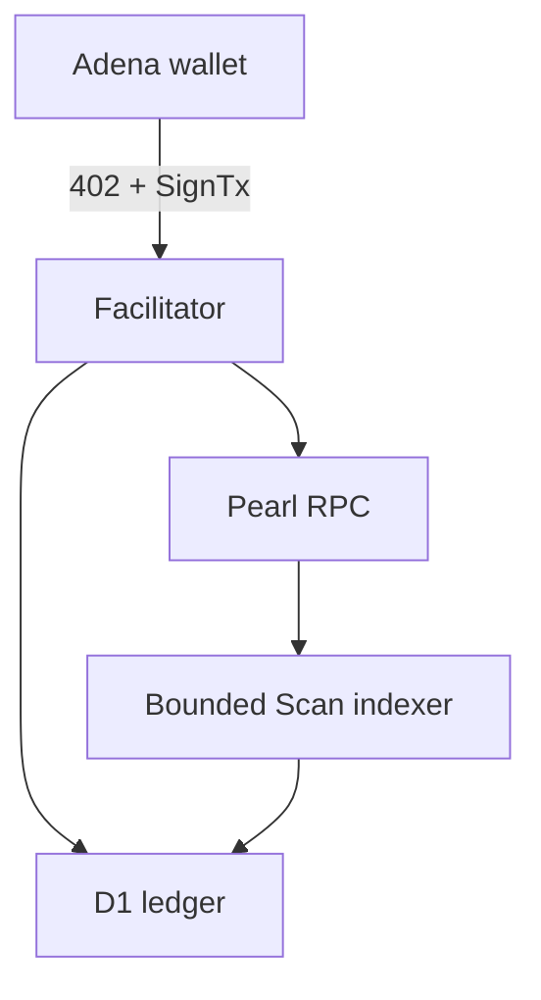

# Architecture

The active Gno product is one authenticated ChatGPT Site backed by Cloudflare D1. Adena keeps the private key in the browser. The server persists a challenge before accepting a signature, verifies the official TM2 transaction bytes, atomically claims the nonce/payment ID, pins the RPC chain ID, broadcasts, and records the result. Scan reads `/block` and `/block_results` together and stores fork-preserving history.

D1 owns issued challenges, payment claims, shared rate buckets, audit rows, blocks, transactions, events and checkpoints. Direct WUGNOT mode requires no server wallet and no deployed realm. Realm mode is a separate rail that may be enabled only after `g402pay` is deployed and accepted on the target chain.

The alternative container topology uses PostgreSQL plus persistent Gno, Akash and Filecoin workers. The shared packages retain canonical request hashing, integer arithmetic and chain-specific codecs, but their live integrations remain independently locked.

Payment state is monotonic during normal processing: an indexer-confirmed `settled` row cannot be downgraded by a later facilitator response. `reverted` is the explicit exception when a canonical block is removed.
